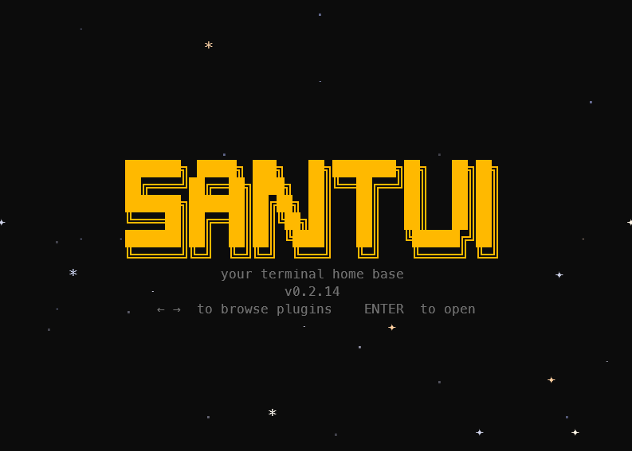

# Santui

[](LICENSE)
[](https://github.com/sonyarianto/santui/actions/workflows/ci.yml)
[](https://www.npmjs.com/package/santui)
[](https://www.npmjs.com/package/santui)
[](https://github.com/sponsors/sonyarianto)

Your terminal home base.

Santui is a keyboard-driven TUI app that lives in your terminal. Think of it as a **launcher for plugins** — the core is lightweight, and everything extra comes through the Plugin Registry.



## What's built in

Out of the box, Santui gives you:

- **Command Palette** — `Ctrl+P` to search and run commands
- **38 Themes** — switch anytime with live preview
- **Plugin Registry** — browse, install, and manage plugins from inside the app
- **Auth** — sign in with Google or GitHub

That's it. No bloat. You add what you need.

## Plugins

Plugins are **standalone binaries** distributed through the Plugin Registry. Open `Ctrl+P` → **Plugin registry**, install what you want, enable it, and it appears in your palette — ready to use.

### Available now

| Plugin | What it does | Needs |
|---|---|---|
| **Radio Stream Player** | Browse stations by country, search, and stream internet radio | [libmpv](https://mpv.io/installation/) |

*More coming. Want to build one? See [docs/architecture.md](docs/architecture.md).*

## Quick start

### Windows

**npm** (recommended) — no admin, no Windows Defender issues, works everywhere. After installing, type `santui` to launch:

```bash
npm install -g santui
santui
```

**PowerShell** — ⚠️ Windows may block the downloaded binary:

```powershell
irm https://santuiapp.vercel.app/install.ps1 | iex
```

### macOS / Linux

**npm** (recommended) — works everywhere, no platform-specific setup. After installing, type `santui` to launch:

```bash
npm install -g santui
santui
```

**Install script** — downloads binary to `~/.local/share/santui/current`:

```bash
curl -fsSL https://santuiapp.vercel.app/install.sh | sh
```

> **Prerequisite:** The npm method requires [Node.js](https://nodejs.org/).

### From source

```bash
git clone https://github.com/sonyarianto/santui
cd santui
cargo build --workspace && cargo run -p santui
```

Requires Rust 1.70+. No plugins included — install them from the Plugin Registry after launching.

### Dev mode (testing plugins locally)

```bash
# Windows
.\scripts\dev-setup.ps1 ; $env:SANTUI_DEV=1; cargo run -p santui

# macOS / Linux
./scripts/dev-setup.sh && SANTUI_DEV=1 cargo run -p santui
```

This builds everything, generates a local plugin manifest, and runs Santui in dev mode — identical flow to production, no release needed.

### CLI flags

| Flag | Action |
|------|--------|
| `--version` / `-V` | Print version and exit |
| `--list-plugins` / `plugins` | List installed and available plugins, then exit |
| `reset` | Delete all data (config, plugins, database) and start fresh |

## Configuration

Santui stores its settings in `config.toml` (TOML format) in the platform-standard data directory (`%APPDATA%/santui` on Windows, `~/.local/share/santui` on Linux, or `~/.santui` in dev mode). Edit the file to set a default theme or custom colour overrides — changes are hot-reloaded automatically. See the full [Configuration reference](https://santuiapp.vercel.app/guide/configuration).

## Documentation

Full docs at [santuiapp.vercel.app](https://santuiapp.vercel.app).
